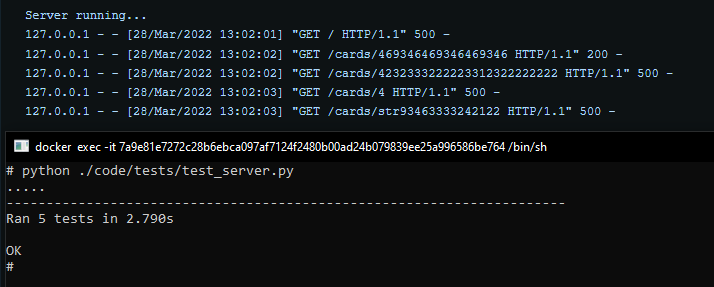

# qa-python-test

В рамках тестового задания разработан http сервер, определяющий банк по номеру банковской карты

## **Как запустить?**
1. Запустить файл base.py
`python .\code\app\base.py`

   
2. Отправить GET запрос с номером карты на сервер localhost'a (по умолчанию 9000 порт)

`curl --location --request GET localhost:9000/cards/10300310300310300310`

Ожидаемый ответ от сервера:
```JSON
{
    "bin": "103003",
    "brand": "PRIVATE LABEL",
    "type": "DEBIT",
    "category": "",
    "issuer": "",
    "alpha_2": "US",
    "alpha_3": "USA",
    "country": "United States",
    "latitude": "37.0902",
    "longitude": "-95.7129",
    "bank_phone": "",
    "bank_url": ""
}
```
## **Дополнительно**
Написаны тесты для сервера `python .\code\tests\test_server.py`


Сервер был упакован в docker-контейнер и протестирован тестами

Упаковать:
 `docker build -t image-name:http_serv_1 .`

Запустить:
`docker run image-name:http_serv_1`


